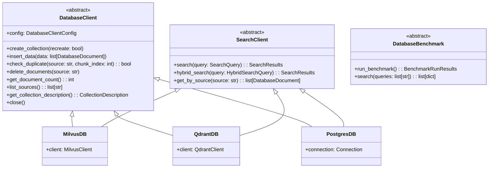

# Database Interface Migration Plan

This document describes the architecture changes and interface definitions needed to support multiple vector database backends (Qdrant, PostgreSQL/pgvector, Weaviate, etc.) in the crawler.

---

## Current Architecture Analysis

The current implementation has these Milvus-specific couplings:

- [milvus_client.py](crawler/src/crawler/vector_db/milvus_client.py): Collection management, insertion, duplicate detection
- [milvus_utils.py](crawler/src/crawler/vector_db/milvus_utils.py): Schema creation with Milvus-specific field types and BM25 functions
- [milvus_benchmarks.py](crawler/src/crawler/vector_db/milvus_benchmarks.py): Hybrid search using `AnnSearchRequest`, `RRFRanker`
- [database_utils.py](crawler/src/crawler/vector_db/database_utils.py): Factory functions hardcoded for Milvus

Key areas requiring abstraction:

- Schema/collection creation (field types, indexes)
- Search operations (dense, sparse, hybrid)
- RBAC/security group filtering
- Collection description storage for config persistence

---

## Proposed Architecture



---

## Phase 1: Expand DatabaseClient Interface

### 1.1 Core Abstract Methods (Required)

Add these methods to [database_client.py](crawler/src/crawler/vector_db/database_client.py):

```python
class DatabaseClient(ABC):
    """Abstract base class for vector database clients."""
    
    config: DatabaseClientConfig
    
    @abstractmethod
    def __init__(
        self,
        config: DatabaseClientConfig,
        embedding_dimension: int,
        crawler_config: "CrawlerConfig",
    ) -> None:
        """Initialize database client and create collection if needed."""
        pass

    @abstractmethod
    def create_collection(self, recreate: bool = False) -> None:
        """Create collection with schema derived from crawler_config."""
        pass

    @abstractmethod
    def insert_data(self, data: list[DatabaseDocument]) -> None:
        """Insert documents with automatic duplicate detection."""
        pass

    @abstractmethod
    def check_duplicate(self, source: str, chunk_index: int) -> bool:
        """Check if a specific chunk exists."""
        pass

    @abstractmethod
    def delete_documents(self, source: str) -> int:
        """Delete all chunks for a source. Returns count deleted."""
        pass

    @abstractmethod
    def get_document_count(self) -> int:
        """Get total document count in collection."""
        pass

    @abstractmethod
    def list_sources(self) -> list[str]:
        """List unique source identifiers."""
        pass

    @staticmethod
    @abstractmethod
    def get_collection_description(config: DatabaseClientConfig) -> CollectionDescription | None:
        """Retrieve collection description (for config restoration)."""
        pass

    @abstractmethod
    def close(self) -> None:
        """Close database connection and cleanup resources."""
        pass
```

### 1.2 Search Interface

Create a new `SearchClient` protocol for search operations:

```python
class SearchQuery(BaseModel):
    """Parameters for a vector search query."""
    query_text: str
    query_embedding: list[float] | None = None  # Optional pre-computed
    filters: list[str] = Field(default_factory=list)
    security_groups: list[str] = Field(default_factory=list)
    limit: int = 10
    offset: int = 0
    output_fields: list[str] = Field(default_factory=list)

class HybridSearchQuery(SearchQuery):
    """Parameters for hybrid search (dense + sparse)."""
    enable_sparse_text: bool = True
    enable_sparse_metadata: bool = True
    rerank_strategy: str = "rrf"  # "rrf", "weighted", "linear"
    dense_weight: float = 0.5
    sparse_weight: float = 0.5

class SearchResult(BaseModel):
    """Single search result."""
    document: DatabaseDocument
    score: float
    distance: float | None = None

class SearchResults(BaseModel):
    """Collection of search results."""
    results: list[SearchResult]
    total_count: int
    query_time_ms: float

class SearchClient(ABC):
    """Abstract interface for search operations."""
    
    @abstractmethod
    def search(self, query: SearchQuery) -> SearchResults:
        """Perform dense vector similarity search."""
        pass
    
    @abstractmethod
    def hybrid_search(self, query: HybridSearchQuery) -> SearchResults:
        """Perform hybrid search combining dense and sparse retrieval."""
        pass
    
    @abstractmethod
    def get_by_source(self, source: str, limit: int = 10000) -> list[DatabaseDocument]:
        """Retrieve all chunks for a given source."""
        pass
    
    @abstractmethod
    def get_by_filter(self, filter_expr: str, limit: int = 100) -> list[DatabaseDocument]:
        """Query documents using a filter expression."""
        pass
```

---

## Phase 2: Schema Abstraction

### 2.1 Abstract Schema Builder

Create [crawler/src/crawler/vector_db/schema.py](crawler/src/crawler/vector_db/schema.py):

```python
class FieldType(Enum):
    """Database-agnostic field types."""
    PRIMARY_KEY = "primary_key"
    VARCHAR = "varchar"
    TEXT = "text"
    INT64 = "int64"
    FLOAT = "float"
    DOUBLE = "double"
    BOOL = "bool"
    JSON = "json"
    ARRAY_VARCHAR = "array_varchar"
    ARRAY_INT = "array_int"
    FLOAT_VECTOR = "float_vector"
    SPARSE_VECTOR = "sparse_vector"

class FieldDefinition(BaseModel):
    """Database-agnostic field definition."""
    name: str
    field_type: FieldType
    description: str = ""
    is_primary: bool = False
    auto_id: bool = False
    max_length: int | None = None  # For VARCHAR
    dimension: int | None = None   # For vectors
    max_capacity: int | None = None  # For arrays
    nullable: bool = True
    default_value: Any = None
    enable_analyzer: bool = False  # For full-text search

class IndexType(Enum):
    """Database-agnostic index types."""
    NONE = "none"
    AUTO = "auto"
    HNSW = "hnsw"
    IVF_FLAT = "ivf_flat"
    INVERTED = "inverted"
    BITMAP = "bitmap"
    BM25 = "bm25"

class IndexDefinition(BaseModel):
    """Database-agnostic index definition."""
    field_name: str
    index_type: IndexType
    metric_type: str = "cosine"  # "cosine", "l2", "ip"
    params: dict[str, Any] = Field(default_factory=dict)

class SchemaDefinition(BaseModel):
    """Complete database-agnostic schema."""
    fields: list[FieldDefinition]
    indexes: list[IndexDefinition]
    description: str = ""
    enable_dynamic_fields: bool = True

class SchemaBuilder(ABC):
    """Abstract base for building provider-specific schemas."""
    
    @abstractmethod
    def build_schema(
        self,
        embedding_dimension: int,
        crawler_config: "CrawlerConfig",
    ) -> Any:
        """Build provider-specific schema from config."""
        pass
    
    @abstractmethod
    def build_indexes(self) -> Any:
        """Build provider-specific index configuration."""
        pass
    
    @staticmethod
    def get_base_fields(embedding_dimension: int) -> list[FieldDefinition]:
        """Return standard base fields common to all providers."""
        return [
            FieldDefinition(
                name="id", field_type=FieldType.PRIMARY_KEY,
                is_primary=True, auto_id=True,
                description="Auto-generated unique record ID"
            ),
            FieldDefinition(
                name="document_id", field_type=FieldType.VARCHAR,
                max_length=64, description="UUID for the document chunk"
            ),
            FieldDefinition(
                name="source", field_type=FieldType.VARCHAR,
                max_length=256, description="Source identifier (file path, URL)"
            ),
            FieldDefinition(
                name="chunk_index", field_type=FieldType.INT64,
                description="Index of chunk within document"
            ),
            FieldDefinition(
                name="text", field_type=FieldType.TEXT,
                max_length=65535, enable_analyzer=True,
                description="Text content of the chunk"
            ),
            FieldDefinition(
                name="text_embedding", field_type=FieldType.FLOAT_VECTOR,
                dimension=embedding_dimension,
                description="Dense vector embedding"
            ),
            FieldDefinition(
                name="security_group", field_type=FieldType.ARRAY_VARCHAR,
                max_capacity=20, max_length=100,
                description="RBAC security groups"
            ),
            FieldDefinition(
                name="metadata", field_type=FieldType.JSON,
                description="User-defined metadata"
            ),
            FieldDefinition(
                name="str_metadata", field_type=FieldType.TEXT,
                max_length=65535, enable_analyzer=True,
                description="Stringified metadata for full-text search"
            ),
            FieldDefinition(
                name="benchmark_questions", field_type=FieldType.VARCHAR,
                max_length=65535, default_value="[]",
                description="Benchmark questions as JSON array"
            ),
        ]
```

### 2.2 Provider-Specific Schema Builders

Each provider implements `SchemaBuilder`:

- `MilvusSchemaBuilder`: Converts to pymilvus `CollectionSchema`
- `QdrantSchemaBuilder`: Converts to Qdrant collection config
- `PostgresSchemaBuilder`: Generates SQL DDL statements

---

## Phase 3: Provider Implementations

### 3.1 Provider Interface Contract

Each provider must implement both `DatabaseClient` and `SearchClient`:

```python
class VectorDBProvider(DatabaseClient, SearchClient, ABC):
    """Combined interface that all providers must implement."""
    
    def __init__(
        self,
        config: DatabaseClientConfig,
        embedding_dimension: int,
        crawler_config: "CrawlerConfig",
    ):
        self.config = config
        self.embedding_dimension = embedding_dimension
        self.crawler_config = crawler_config
        self._connect()
        self.create_collection(recreate=config.recreate)
    
    @abstractmethod
    def _connect(self) -> None:
        """Establish connection to database."""
        pass
```

### 3.2 Implementation File Structure

```
crawler/src/crawler/vector_db/
├── __init__.py              # Public exports
├── database_client.py       # Abstract interfaces
├── schema.py                # Schema abstraction (NEW)
├── database_utils.py        # Factory functions
├── providers/               # Provider implementations (NEW)
│   ├── __init__.py
│   ├── milvus/
│   │   ├── __init__.py
│   │   ├── client.py        # MilvusDB implementation
│   │   ├── schema.py        # MilvusSchemaBuilder
│   │   ├── search.py        # Milvus-specific search
│   │   └── benchmark.py     # MilvusBenchmark
│   ├── qdrant/
│   │   ├── __init__.py
│   │   ├── client.py        # QdrantDB implementation
│   │   ├── schema.py        # QdrantSchemaBuilder
│   │   ├── search.py        # Qdrant-specific search
│   │   └── benchmark.py     # QdrantBenchmark
│   └── postgres/
│       ├── __init__.py
│       ├── client.py        # PostgresDB implementation
│       ├── schema.py        # PostgresSchemaBuilder
│       ├── search.py        # pgvector search
│       └── benchmark.py     # PostgresBenchmark
```

### 3.3 Provider Registration

Update `DatabaseClientConfig` to support provider discovery:

```python
class DatabaseClientConfig(BaseModel):
    provider: str  # "milvus", "qdrant", "postgres"
    collection: str
    # Connection params vary by provider
    host: str = "localhost"
    port: int = 19530
    username: str = ""
    password: str = ""
    # Provider-specific options
    extra_options: dict[str, Any] = Field(default_factory=dict)
    
    @classmethod
    def milvus(cls, collection: str, **kwargs) -> "DatabaseClientConfig":
        return cls(provider="milvus", collection=collection, port=19530, **kwargs)
    
    @classmethod
    def qdrant(cls, collection: str, **kwargs) -> "DatabaseClientConfig":
        return cls(provider="qdrant", collection=collection, port=6333, **kwargs)
    
    @classmethod
    def postgres(cls, collection: str, database: str = "vectors", **kwargs) -> "DatabaseClientConfig":
        return cls(
            provider="postgres", collection=collection, port=5432,
            extra_options={"database": database, **kwargs.pop("extra_options", {})},
            **kwargs
        )
```

---

## Phase 4: Factory and Registration System

### 4.1 Provider Registry

Update [database_utils.py](crawler/src/crawler/vector_db/database_utils.py):

```python
from typing import Type

# Provider registry
_PROVIDERS: dict[str, Type[VectorDBProvider]] = {}

def register_provider(name: str, provider_class: Type[VectorDBProvider]) -> None:
    """Register a database provider."""
    _PROVIDERS[name] = provider_class

def get_db(
    config: DatabaseClientConfig,
    dimension: int,
    crawler_config: "CrawlerConfig",
) -> DatabaseClient:
    """Factory function to get database client by provider."""
    if config.provider not in _PROVIDERS:
        available = list(_PROVIDERS.keys())
        raise ValueError(
            f"Unsupported provider: {config.provider}. "
            f"Available: {available}"
        )
    return _PROVIDERS[config.provider](config, dimension, crawler_config)

def get_search_client(
    config: DatabaseClientConfig,
    embed_config: "EmbedderConfig",
) -> SearchClient:
    """Factory function to get search client by provider."""
    if config.provider not in _PROVIDERS:
        raise ValueError(f"Unsupported provider: {config.provider}")
    # Provider implements both interfaces
    return _PROVIDERS[config.provider](config, embed_config.dimension, None)

# Register built-in providers
def _register_builtins():
    from .providers.milvus import MilvusDB
    register_provider("milvus", MilvusDB)
    
    # Optional providers - only register if dependencies available
    try:
        from .providers.qdrant import QdrantDB
        register_provider("qdrant", QdrantDB)
    except ImportError:
        pass
    
    try:
        from .providers.postgres import PostgresDB
        register_provider("postgres", PostgresDB)
    except ImportError:
        pass

_register_builtins()
```

---

## Phase 5: Complete Interface Specification

### Required Methods for Full Functionality

| Method | Purpose | Milvus | Qdrant | Postgres |

|--------|---------|--------|--------|----------|

| `__init__` | Connect and setup | MilvusClient | QdrantClient | psycopg2/asyncpg |

| `create_collection` | Create collection/table | create_collection | create_collection | CREATE TABLE + extensions |

| `insert_data` | Bulk insert | insert + flush | upsert | COPY or batch INSERT |

| `check_duplicate` | Duplicate detection | query by filter | scroll/search | SELECT EXISTS |

| `delete_documents` | Delete by source | delete by filter | delete by filter | DELETE WHERE |

| `get_document_count` | Count documents | query count | count | SELECT COUNT(*) |

| `list_sources` | Unique sources | query distinct | scroll + aggregate | SELECT DISTINCT |

| `search` | Dense vector search | search | search | pgvector <-> operator |

| `hybrid_search` | Dense + sparse | hybrid_search + RRF | search with fusion | pgvector + ts_rank |

| `get_by_source` | Fetch by source | query | scroll | SELECT WHERE |

| `get_collection_description` | Config persistence | describe_collection | collection_info | table comment |

| `close` | Cleanup | close | close | close |

### Search Capabilities Matrix

| Capability | Milvus | Qdrant | Postgres/pgvector |

|------------|--------|--------|-------------------|

| Dense vector (HNSW) | Yes | Yes | Yes (pgvector) |

| Dense vector (IVF) | Yes | Yes | No |

| Sparse (BM25) | Yes (built-in) | No (requires custom) | Yes (tsvector) |

| Hybrid search | Yes (RRF) | Yes (prefetch+fusion) | Manual combination |

| Metadata filtering | Yes | Yes (payload filters) | Yes (WHERE clause) |

| Array contains | Yes | Yes | Yes (@> operator) |

| Full-text search | Yes (BM25 function) | No | Yes (to_tsvector) |

---

## Phase 6: Migration Steps

### Step 1: Create Schema Abstraction (Day 1-2)

- Create `schema.py` with `FieldType`, `FieldDefinition`, `IndexDefinition`, `SchemaBuilder`
- Implement `MilvusSchemaBuilder` based on existing `milvus_utils.py`
- Ensure backward compatibility

### Step 2: Expand DatabaseClient Interface (Day 2-3)

- Add `delete_documents`, `get_document_count`, `list_sources`, `close`
- Add `SearchClient` protocol
- Create `SearchQuery`, `SearchResult`, `SearchResults` models

### Step 3: Refactor Milvus Implementation (Day 3-4)

- Move existing Milvus code to `providers/milvus/`
- Implement all new interface methods
- Consolidate search into `SearchClient` implementation

### Step 4: Create Provider Registration (Day 4)

- Update `database_utils.py` with registry pattern
- Add provider discovery
- Update `__init__.py` exports

### Step 5: Implement Qdrant Provider (Day 5-7)

- Create `providers/qdrant/client.py`
- Implement schema mapping
- Implement search (note: no native BM25)

### Step 6: Implement PostgreSQL Provider (Day 7-9)

- Create `providers/postgres/client.py`
- Implement pgvector integration
- Implement tsvector for full-text search

### Step 7: Update Crawler Integration (Day 9-10)

- Update `main.py` to use new interfaces
- Update `get_db` and `get_db_benchmark` calls
- Add tests for each provider

---

## Example: Implementing a New Provider (Qdrant)

```python
# providers/qdrant/client.py
from qdrant_client import QdrantClient
from qdrant_client.models import (
    Distance, VectorParams, PointStruct,
    Filter, FieldCondition, MatchAny
)

class QdrantDB(VectorDBProvider):
    """Qdrant implementation of the vector database interface."""
    
    def _connect(self) -> None:
        self.client = QdrantClient(
            host=self.config.host,
            port=self.config.port,
            api_key=self.config.password if self.config.password else None,
        )
    
    def create_collection(self, recreate: bool = False) -> None:
        exists = self.client.collection_exists(self.config.collection)
        if exists and recreate:
            self.client.delete_collection(self.config.collection)
            exists = False
        
        if not exists:
            self.client.create_collection(
                collection_name=self.config.collection,
                vectors_config=VectorParams(
                    size=self.embedding_dimension,
                    distance=Distance.COSINE,
                ),
            )
    
    def insert_data(self, data: list[DatabaseDocument]) -> None:
        points = []
        for doc in data:
            if self.check_duplicate(doc.source, doc.chunk_index):
                continue
            points.append(PointStruct(
                id=str(uuid.uuid4()),
                vector=doc.text_embedding,
                payload={
                    "document_id": doc.document_id,
                    "source": doc.source,
                    "chunk_index": doc.chunk_index,
                    "text": doc.text,
                    "security_group": doc.security_group,
                    "metadata": doc.metadata,
                }
            ))
        
        if points:
            self.client.upsert(
                collection_name=self.config.collection,
                points=points,
            )
    
    def search(self, query: SearchQuery) -> SearchResults:
        # Build filter for security groups
        must_conditions = []
        if query.security_groups:
            must_conditions.append(
                FieldCondition(
                    key="security_group",
                    match=MatchAny(any=query.security_groups)
                )
            )
        
        results = self.client.search(
            collection_name=self.config.collection,
            query_vector=query.query_embedding,
            query_filter=Filter(must=must_conditions) if must_conditions else None,
            limit=query.limit,
            offset=query.offset,
        )
        
        return SearchResults(
            results=[
                SearchResult(
                    document=DatabaseDocument(**r.payload),
                    score=r.score,
                )
                for r in results
            ],
            total_count=len(results),
            query_time_ms=0,  # Qdrant doesn't provide this
        )
    
    def close(self) -> None:
        self.client.close()
```

---

## Dependencies by Provider

```toml
# pyproject.toml
[project.optional-dependencies]
milvus = ["pymilvus>=2.6.0"]
qdrant = ["qdrant-client>=1.7.0"]
postgres = ["psycopg2-binary>=2.9.0", "pgvector>=0.2.0"]
all = ["pymilvus>=2.6.0", "qdrant-client>=1.7.0", "psycopg2-binary>=2.9.0", "pgvector>=0.2.0"]
```

---

## Testing Strategy

Each provider needs tests for:

- Connection and authentication
- Collection creation/recreation
- Document insertion and duplicate detection
- Vector search accuracy
- Hybrid search (where supported)
- Security group filtering
- Config persistence/restoration
- Edge cases (empty results, large batches)

Use a common test suite that runs against any registered provider.